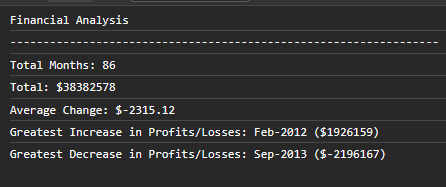
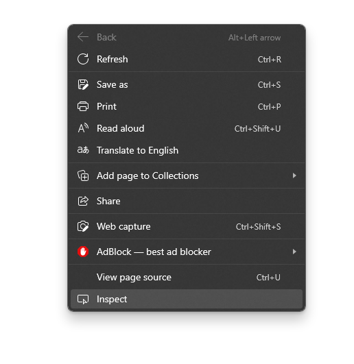

# Console-Finances

## Description

This is the week 4 challange for the Front End Skills bootcamp. This is the first challange working with javascript. This task is to create a JS program which analyses a dataset and display data a company may find useful including the number of months or the total profits & losses for their data. 

This JS program doesn't use a GUI and just outputs to console.

This here is the resutlts.

## Installation

You can pull this repo or you can view on [git hub pages](https://dani57t.github.io/Console-Finances/)

## Usage

To use this project, open the index.html page and right click on the page in a browser and navigate to inspect, then in the inspect tool click console.

## Credits

I followed tutorials on [W3Schools](https://www.w3schools.com/)

## License

MIT

Dani Taylor 2023
